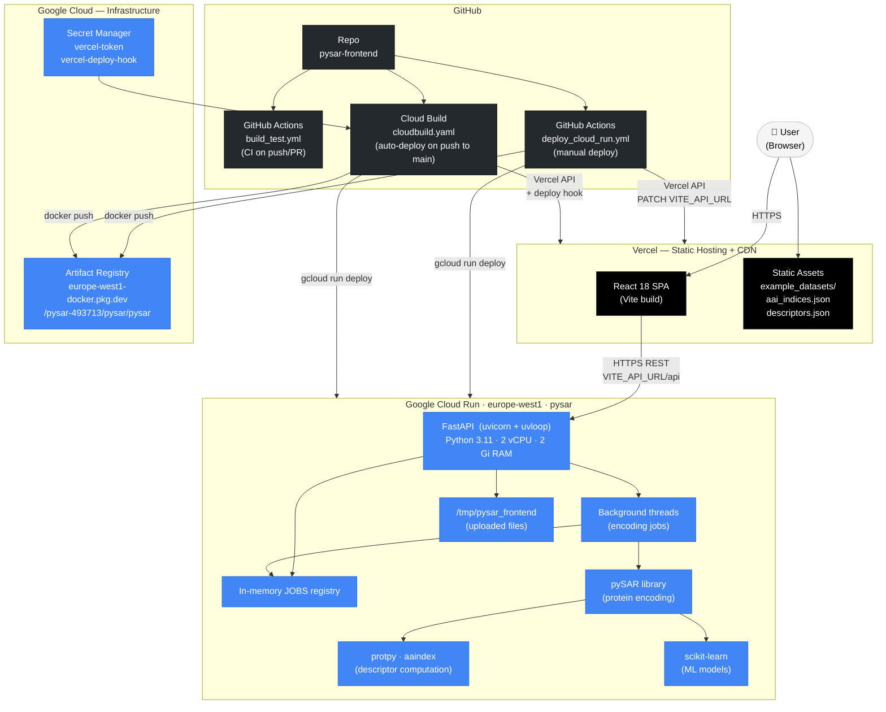
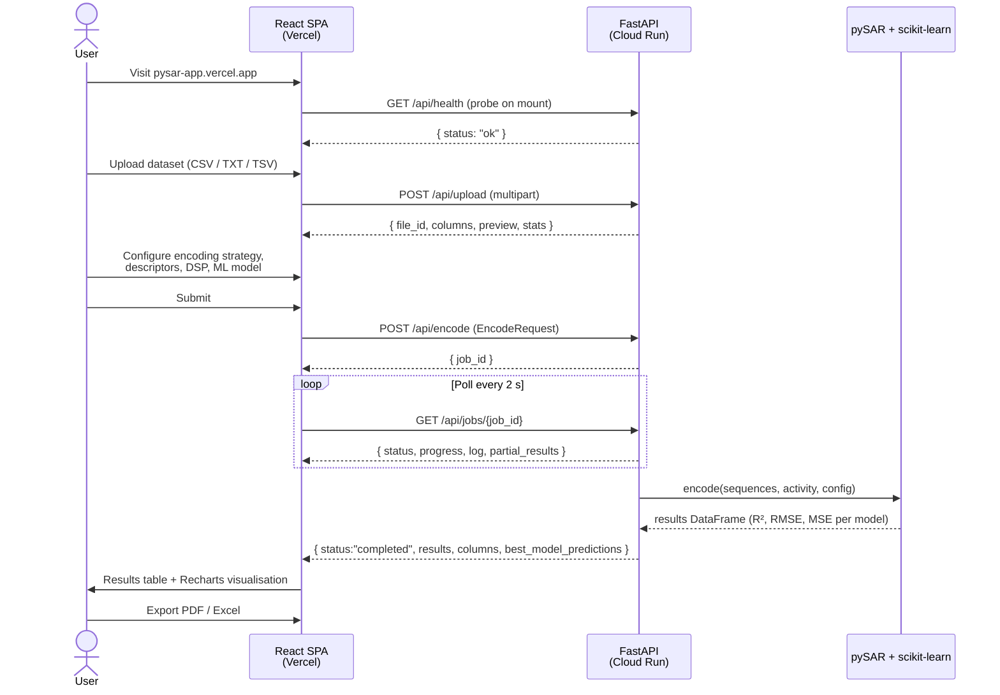
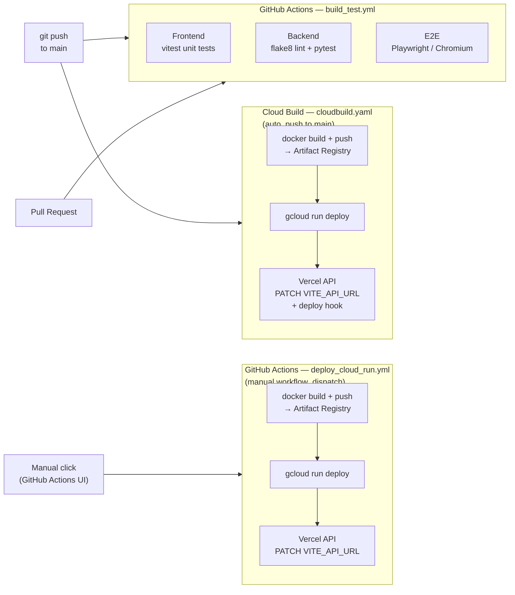

# pySAR App — Architecture

pySAR is a web application for protein sequence activity relationship (SAR) modelling. A user uploads a labelled dataset of protein sequences, configures an encoding strategy and ML model, submits a job, and receives ranked results with performance metrics and charts.

---

## System topology



---

## User journey / data flow



---

## CI/CD pipeline



---

## Frontend

**Deployed on:** Vercel (static SPA + CDN)
**URL:** `https://pysar-app.vercel.app`
**Build tool:** Vite 5

### Stack

| Concern | Library | Version |
|---|---|---|
| UI framework | React | 18.3 |
| Build | Vite + @vitejs/plugin-react | 5.4 |
| Styling | Tailwind CSS + PostCSS + Autoprefixer | 3.4 |
| State management | Zustand (with `persist` middleware) | 4.5 |
| HTTP | Axios | 1.7 |
| Charts | Recharts | 2.15 |
| Icons | @heroicons/react | 2.2 |
| File input | react-dropzone | 14.3 |
| Notifications | react-hot-toast | 2.4 |
| PDF export | jsPDF | 4.2 |
| Excel export | xlsx (SheetJS) | 0.18 |
| Celebrations | canvas-confetti | 1.9 |
| Unit tests | Vitest + @testing-library/react | 3.0 |
| E2E tests | Playwright (Chromium) | — |

### Vite dev proxy

In development, Vite proxies all `/api` requests to `http://localhost:8000` so the frontend can talk to a local FastAPI instance without CORS configuration. In production, `VITE_API_URL` is set by Vercel to the Cloud Run service URL and the frontend builds absolute API URLs at compile time.

### State management

Zustand holds the entire application state in a single flat store (`appStore.js`). Only a selective subset is persisted to `localStorage` via the `persist` middleware:

| Persisted key | Purpose |
|---|---|
| `darkMode` | Dark/light mode preference |
| `showLanding` | Whether to show the landing page on next visit |
| `config` | Last-used encoding/model configuration |
| `aaiIndicesCache` | Cached AAI index list (avoids re-fetch) |

Transient state — dataset, step, active job, encoding queue, results — is intentionally **not** persisted so a page refresh always returns a clean state.

### Component structure

```
App.jsx                         ← root; step router; backend health probe
├── LandingPage.jsx             ← intro / entry screen
├── Layout.jsx                  ← top nav, dark-mode toggle, explorer launchers
├── ErrorBoundary.jsx           ← React error boundary
│
├── steps/
│   ├── Step1Upload.jsx         ← dataset upload (drag-drop, file picker, examples)
│   │   └── DatasetPreview.jsx  ← table preview + data quality tools
│   ├── Step2Configure.jsx      ← three-panel config editor
│   │   ├── ModelConfig.jsx     ← algorithm picker, CV/holdout, hyperparams
│   │   ├── DescriptorConfig.jsx← descriptor selector + per-descriptor params
│   │   ├── DSPConfig.jsx       ← digital signal processing settings
│   │   └── ConfigPreview.jsx   ← live JSON preview, import/export, save/load
│   ├── Step3Encode.jsx         ← job submission, progress polling, queue
│   └── Step4Results.jsx        ← results table, sorting, export
│       └── ResultsCharts.jsx   ← Recharts scatter/bar/line visualisations
│
└── components/
    ├── JobsPanel.jsx           ← job history overlay (persisted in localStorage)
    ├── ModelExplorer.jsx       ← browse available ML algorithms + docs
    ├── AaiExplorer.jsx         ← browse 566 AAI1 amino acid indices
    ├── DescriptorExplorer.jsx  ← browse protein descriptor catalogue
    ├── HelpTooltip.jsx         ← inline contextual help
    ├── HowToModal.jsx          ← guided walkthrough modal
    └── Skeleton.jsx            ← loading skeleton components
```

### HTTP client (`utils/api.js`)

- Single Axios instance with `baseURL = VITE_API_URL/api` (or `/api` via Vite proxy in dev)
- Default 30-second timeout; upload endpoints set `timeout: 0` (unlimited) to handle large files
- Retry interceptor: up to 3 retries on `GET` requests returning 502/503, with exponential backoff (1 s → 2 s → 4 s)
- Static fallback: `getAaiIndicesFull()` and `getDescriptors()` fall back to bundled JSON files served from Vercel's CDN when the backend is unreachable

### Example datasets

Four built-in datasets (thermostability, absorption, enantioselectivity, localization) are served as static `.txt` files from `/example_datasets/` by Vercel. When the user loads one, the file is fetched from the CDN and parsed entirely **client-side** by `parseDatasetClientSide()`. The parsed object is stored in app state with a `_pendingFile` flag; Step 3 lazily uploads the file to the backend only when a job is submitted.

---

## Backend

**Deployed on:** Google Cloud Run, region `europe-west1`
**Service:** `pysar`
**URL:** `https://pysar-682913119755.europe-west1.run.app`
**Language:** Python 3.11
**Server:** uvicorn 0.30+ with uvloop event loop, single worker

### Stack

| Concern | Library | Version |
|---|---|---|
| Web framework | FastAPI | ≥0.115 |
| ASGI server | uvicorn[standard] + uvloop | ≥0.30 |
| Data handling | pandas | ≥2.0 |
| Numerical | numpy, scipy | latest |
| ML | scikit-learn | latest |
| Protein encoding | pySAR | GitHub `@master` |
| Descriptors | protpy | ≥1.3.0 |
| AAI indices | aaindex | ≥1.2.0 |
| File upload | python-multipart | ≥0.0.9 |
| Validation | Pydantic v2 | (via FastAPI) |
| Tests | pytest, pytest-cov, httpx | ≥8.0 / ≥4.0 / ≥0.27 |

### API routes

| Method | Path | Purpose |
|---|---|---|
| `GET` | `/` | Redirect to frontend (CORS_ORIGIN) or `/api/docs` |
| `GET` | `/api/health` | Liveness probe — returns `{"status":"ok"}` |
| `GET` | `/api/version` | Backend, pySAR, and Python version strings |
| `GET` | `/api/aai-indices` | 566 AAI1 record codes (for typeahead) |
| `GET` | `/api/aai-indices-full` | AAI1 records with code + title (for explorer) |
| `GET` | `/api/descriptors` | Full descriptor catalogue with metadata |
| `POST` | `/api/upload` | Upload dataset (CSV/TSV/TXT); returns preview + stats |
| `POST` | `/api/upload-descriptors` | Upload pre-computed descriptors CSV |
| `GET` | `/api/dataset/{id}/rows` | All rows of an uploaded dataset |
| `POST` | `/api/dataset/{id}/deduplicate` | Remove duplicate sequences |
| `POST` | `/api/dataset/{id}/fix-missing-sequences` | Drop rows with null sequences |
| `POST` | `/api/dataset/{id}/fix-missing-activity` | Fill / remove missing activity values |
| `POST` | `/api/dataset/{id}/fix-outliers` | Winsorize or remove outlier activity values |
| `GET` | `/api/example-datasets` | List built-in sample datasets |
| `POST` | `/api/example-dataset/{name}` | Load a built-in dataset by name |
| `POST` | `/api/encode` | Submit encoding job; returns `job_id` |
| `GET` | `/api/jobs` | List all jobs (no results payload) |
| `GET` | `/api/jobs/{job_id}` | Job status, progress, log, and results |
| `POST` | `/api/jobs/{job_id}/cancel` | Cancel a running job |
| `DELETE` | `/api/jobs/{job_id}` | Remove a completed job from the registry |

Interactive docs are available at `/api/docs` (Swagger UI).

### Job lifecycle

Encoding is computationally intensive and can take minutes. The backend uses a fire-and-poll pattern to avoid HTTP timeouts:

1. `POST /api/encode` validates the request, assigns a UUID `job_id`, stores a pending job record in the `JOBS` dict, starts a **background daemon thread**, and returns `{"job_id": "..."}` immediately.
2. The background thread calls `pySAR.Encoding()`, computes all model combinations, and writes progress and partial results back to the `JOBS` dict at each milestone.
3. The frontend polls `GET /api/jobs/{job_id}` every 2 seconds; the response includes `status`, `progress` (0–100), `log` lines, and `partial_results` (top-10 rows as they become available).
4. On completion the full results DataFrame is stored in `JOBS[job_id]["results"]`. On cancellation, the cancel event is set and the subprocess is sent `SIGTERM`.

A single worker process is used (`--workers 1`) because the job registry is in-memory. Multiple instances would fragment the job state across containers — hence `--max-instances=1` on Cloud Run.

### Rate limiting

A custom sliding-window rate limiter (no external dependency) runs as ASGI middleware:

| Endpoint | Limit |
|---|---|
| `POST /api/encode` | 5 requests / 60 s per IP |
| `POST /api/upload` | 20 requests / 60 s per IP |

The real client IP is read from `X-Forwarded-For` only when `TRUST_PROXY=true` (set on Cloud Run to handle the GCP load balancer hop).

### CORS

Allowed origins are built at startup:

- Always: `http://localhost:5173`, `http://127.0.0.1:5173`
- If `VERCEL_URL` env var is set: `https://{VERCEL_URL}`
- If `CORS_ORIGIN` env var is set (set on Cloud Run): that value (e.g. `https://pysar-app.vercel.app`)

### Background maintenance threads

Two daemon threads start at app startup via the FastAPI `lifespan` handler:

| Thread | Purpose |
|---|---|
| `_prewarm_pysar` | Imports `pySAR.Encoding` immediately so the first encoding job doesn't pay the cold-start import cost |
| `_cleanup_upload_dir` | Runs every hour: deletes temp files older than 6 h, evicts completed jobs past their 30-minute TTL, prunes ghost job records whose upload files no longer exist, and clears expired rate-limit buckets |

### Logging

All log output is emitted as single-line JSON (`{"severity":…, "message":…, "logger":…, "time":…}`) which GCP Cloud Logging parses natively and indexes by severity level.

---

## Infrastructure

### Google Cloud Run

| Setting | Value |
|---|---|
| Service name | `pysar` |
| Region | `europe-west1` |
| Project | `pysar-493713` |
| Memory | 2 Gi |
| CPU | 2 vCPU (always allocated, no throttling) |
| Min instances | 1 (always warm — no cold starts) |
| Max instances | 1 (single instance to keep JOBS state coherent) |
| Request timeout | 3600 s |
| Authentication | Public (`allUsers` → `roles/run.invoker`) |
| Startup CPU boost | Enabled (faster numpy/scipy import) |

### Docker image

The image uses a **two-stage build** to keep the runtime image lean:

```
Stage 1 — builder (python:3.11-slim)
  apt-get: gcc, g++, git          ← native build tools
  pip install --prefix=/install   ← all Python deps incl. pySAR from GitHub

Stage 2 — runtime (python:3.11-slim)
  COPY --from=builder /install /usr/local   ← only compiled packages, no build tools
  COPY backend/                              ← application code
  COPY example_datasets/                    ← built-in datasets
  WORKDIR /app/backend
  EXPOSE 8080
  CMD uvicorn main:app --host 0.0.0.0 --port 8080 --workers 1 --loop uvloop
```

### Artifact Registry

Images are pushed to `europe-west1-docker.pkg.dev/pysar-493713/pysar/pysar` tagged with the git SHA (immutable) and `latest` (mutable pointer).

### Secret Manager

`vercel-token` and `vercel-deploy-hook` are stored in GCP Secret Manager and injected into Cloud Build steps at build time via `availableSecrets`. They are never stored in the repo or environment variables of the deployed service.

### Vercel

| Setting | Value |
|---|---|
| Project | `amckenna41s-projects/pysar` |
| Framework | None (static site) |
| Install command | `cd frontend && npm install` |
| Build command | `cd frontend && npm run build` |
| Output directory | `frontend/dist` |
| Production URL | `https://pysar-app.vercel.app` |
| Key env var | `VITE_API_URL` → Cloud Run service URL |

---

## pySAR encoding library

pySAR (installed directly from GitHub — the `pysar` PyPI package is an unrelated InSAR tool) is the scientific core of the application. It exposes an `Encoding` class that accepts a protein sequence dataset, an encoding strategy, and an ML model, and returns a results DataFrame.

### Encoding strategies

| Strategy | Description |
|---|---|
| `aai` | Encode sequences using AAI1 amino acid indices (physico-chemical property scales). Each of 566 indices is tried, the sequence is numerically encoded, optional DSP (FFT spectrum) is applied, and an ML model is trained and evaluated. |
| `descriptor` | Encode using protein descriptors computed by **protpy** — structural, compositional, and autocorrelation features derived directly from the amino acid sequence. |
| `aai_descriptor` | Concatenate AAI-encoded features with descriptor features before training. |

### Supported descriptors (protpy)

Amino acid composition, dipeptide composition, tripeptide composition, Moran/Geary/MoreauBroto autocorrelation, CTD (composition/transition/distribution), sequence order coupling number, quasi-sequence order, pseudo amino acid composition, amphiphilic pseudo amino acid composition, charge distribution, k-mer composition, reduced alphabet composition, hydrophobic moment.

### Supported ML models (scikit-learn)

PLS regression, linear regression, ridge regression, lasso, elastic net, random forest, gradient boosting, support vector regression (SVR), k-nearest neighbours, decision tree, AdaBoost, bagging.

### Digital Signal Processing (pyDSP)

When `use_dsp: true`, sequences are numerically encoded via an AAI index and then passed through a signal-processing pipeline (FFT power/magnitude/real/imaginary spectrum, optional window functions, optional Savitzky-Golay / median filter) before the ML model is trained on the frequency-domain features.

---

## Local development

```
# Backend
cd backend
pip install -r requirements.txt
uvicorn main:app --reload --port 8000

# Frontend (separate terminal)
cd frontend
npm install
npm run dev          # http://localhost:5173

# Tests
cd frontend && npm test          # vitest
cd backend  && pytest            # unit + integration
npx playwright test              # e2e (requires backend running)
```

The Vite dev proxy forwards all `/api` requests to `http://localhost:8000` so no CORS configuration is needed during development.
